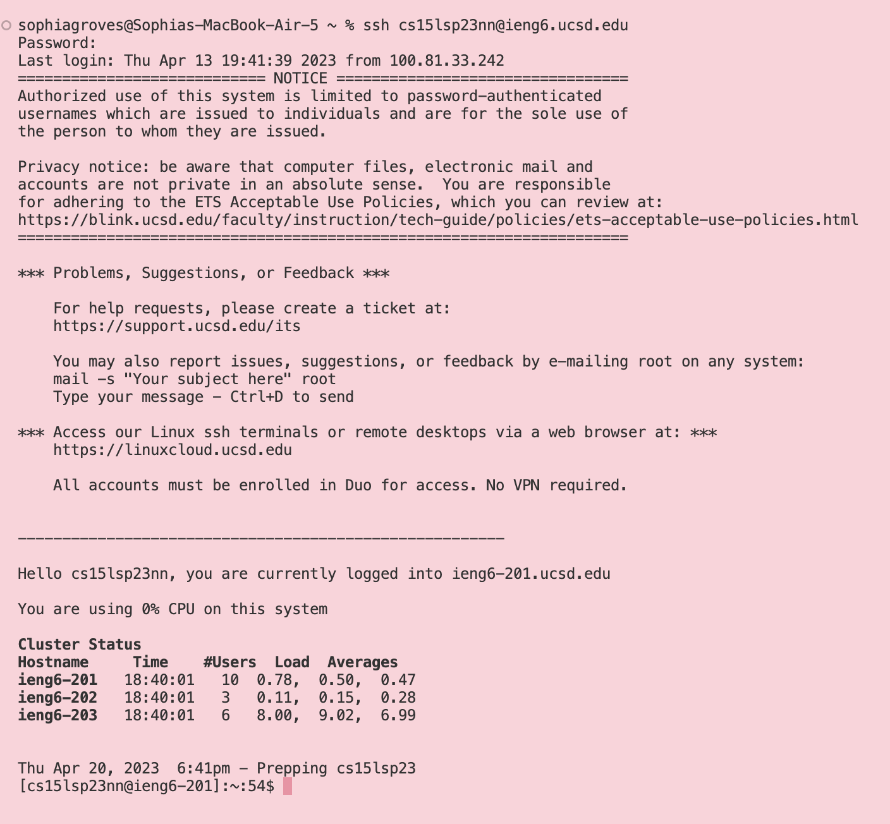
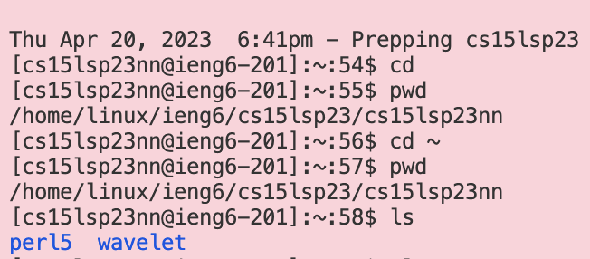

# lab report one

**Hello! Here is a step by step tutorial on how to log into a course specific acount on ieng6.**

## Step One: installing VScode
1. I already have VScode on my laptop, so I skip installing and simply open the program from my mac's dock. However, if you don't have VScode, you can go [here](https://code.visualstudio.com/) and follow the instructions on the website. 

## Step Two: remotely connecting
1. I skip installing git step because I am not using a windows device.
2. I open a terimnal on VScode using the terminal > new terminal option at the top of the screen.

3. I type into the terminal my unique course specific account, which for this class is: `$ ssh cs15lsp23nn@ieng6.ucsd.edu` where $ denotes the beginning of my command. I can find this by going to [https://sdacs.ucsd.edu/~icc/index.php](https://sdacs.ucsd.edu/~icc/index.php) and logging in with my school ID into Account Lookup. After logging in, my CSE username is listed under the Additional Accounts option. 
4. If the following message appears for connecting to a server for the first time: Are you sure you want to continue connecting (yes/no/[fingerprint])? I will type yes into the terminal then enter.
6. I type in my password when prompted, noting that though nothing shows up when typing it still is being inputed.
7. I will know I'm logged in when I receive the message: `Hello cs15lsp23nn, you are currently logged into ieng6-203.ucsd.edu.`

(If I do or do not get the notice its okay)

## Step Three: Trying some commands
1. To try some commands, I can enter any of the following into the terminal : `cd`, `cd ~`, `ls`, `pwd`, etc.
`cd` will change the working directory to whatever I enter after, or to my home directory if I don't add anything. `cd~` will change the working directory to the home directory. `ls` will print all the files in my current working directory. `pwd` will print my current working directory. 

