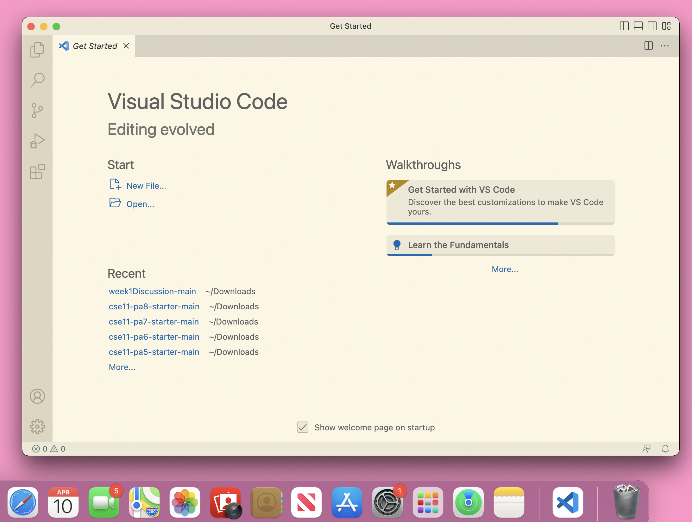
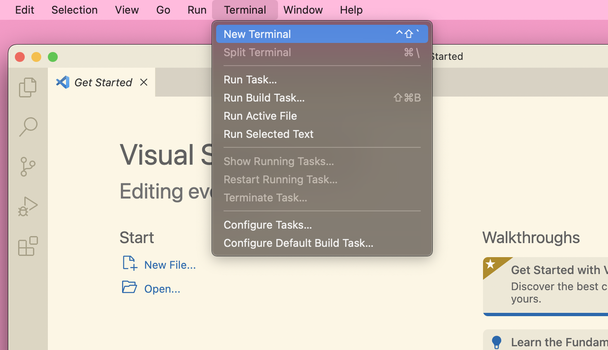
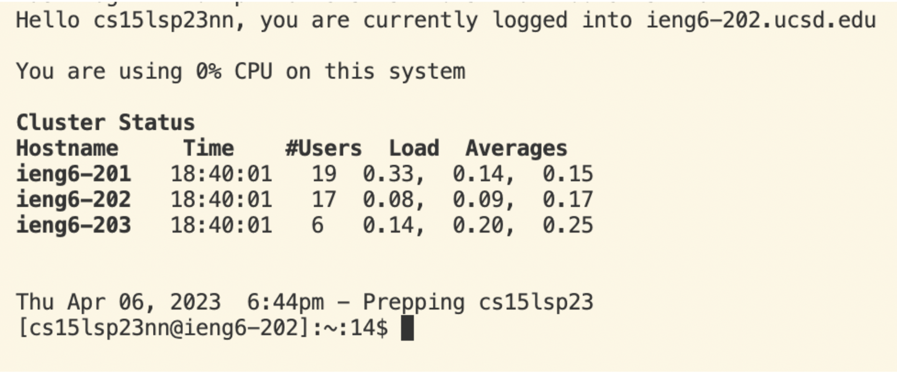
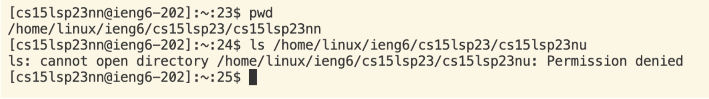

# lab report one

**Hello! Here is a step by step tutorial on how to log into a course specific acount on ieng6.**

## Step One: installing VScode
1. I already have VScode on my laptop, so I skip installing and simply open the program from my mac's dock. However, if you don't have VScode, you can go [here](https://code.visualstudio.com/) and follow the instructions on the website. 

## Step Two: remotely connecting
1. I skip installing git step because I am not using a windows device.
2. I open a terimnal on VScode using the terminal > new terminal option at the top of the screen.

3. I type into the terminal my unique course specific account, which for this class is: $ ssh cs15lsp23nn@ieng6.ucsd.edu where $ denotes the beginning of my command.
4. If the following message appears for connecting to a server for the first time: Are you sure you want to continue connecting (yes/no/[fingerprint])? I will type yes into the terminal then enter.
6. I type in my password when prompted, noting that though nothing shows up when typing it still is being inputed.
7. I will know I'm logged in when I receive the message Hello cs15lsp23nn, you are currently logged into ieng6-203.ucsd.edu.

## Step Three: Trying some commands
1. To try some command, I can enter any of the following into the terminal : cd, cd ~, ls -lat, ls -a, etc.

