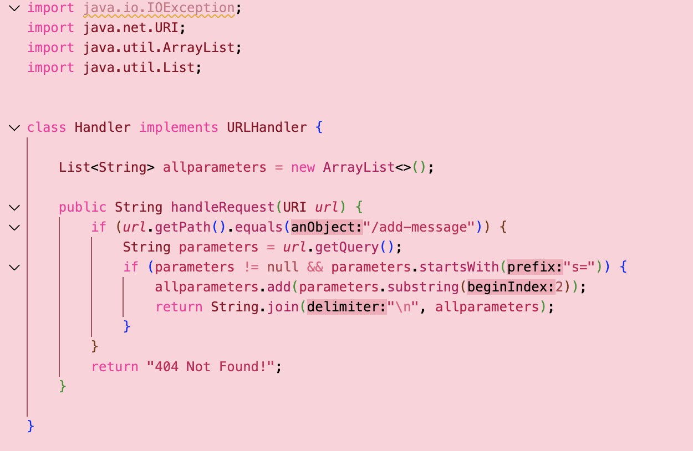
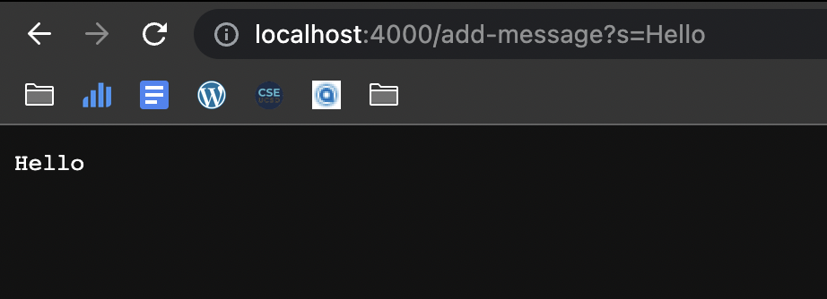
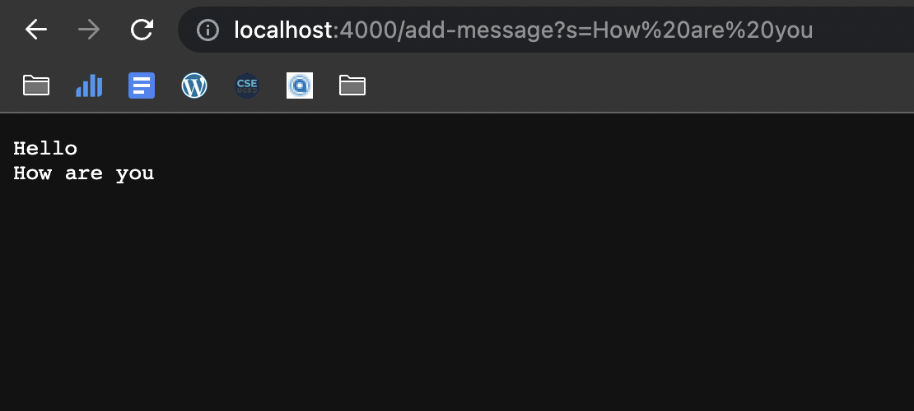
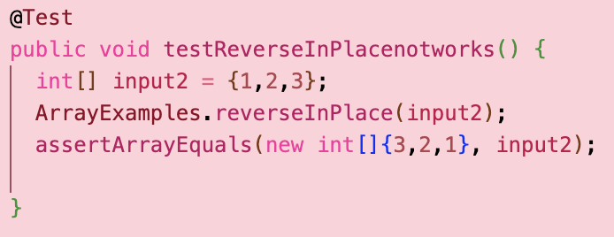
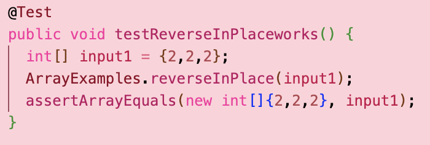
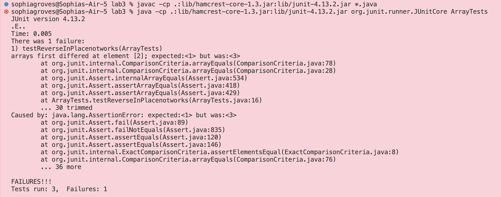
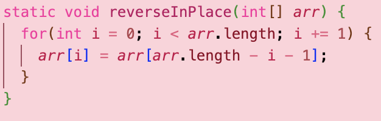
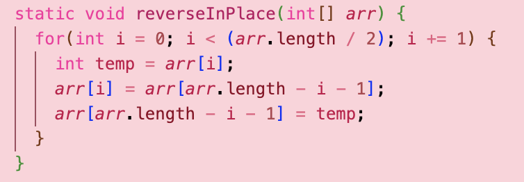

# lab report two

## Part 1: Server

1. The `handleRequest` method is called. 
2. The relevant argument to the `handleRequest method` is the instance of the `URI` class, which is the URL requested by me: [http://localhost:4000/add-message?s=Hello](http://localhost:4000/add-message?s=Hello). The relevant field for the `Handler` class is the `allparameters` field, which is a `List<String>`. The value of the `allparameters` field is a list with one string element, `"Hello"`.
3. Yes, the value of the `allparameters` field changed from an empty list to a list with the string element `"Hello"`.

1. The `handleRequest` method is called. 
2. The relevant argument to the `handleRequest method` is the instance of the `URI` class, which is the URL requested by me: [http://localhost:4000/add-message?s=How%20are%20you](http://localhost:4000/add-message?s=Hello). The relevant field for the `Handler` class is the `allparameters` field, which is a `List<String>`. The value of the `allparameters` field is a list with two string elements, `"Hello", "How Are You."`.
3. Yes, the value of the `allparameters` field changed from a list with one string element `"Hello"` to a list with two string elements `"Hello", "How Are You."`.

## Part 2: Bugs
**Failure inducing input for bug code:**

**Non failure inducing input for bug code:**

**The symptom as output of running the tests:**

**The code before debugging:**

**The code after debugging:**

## Part 3: What I Learned 
