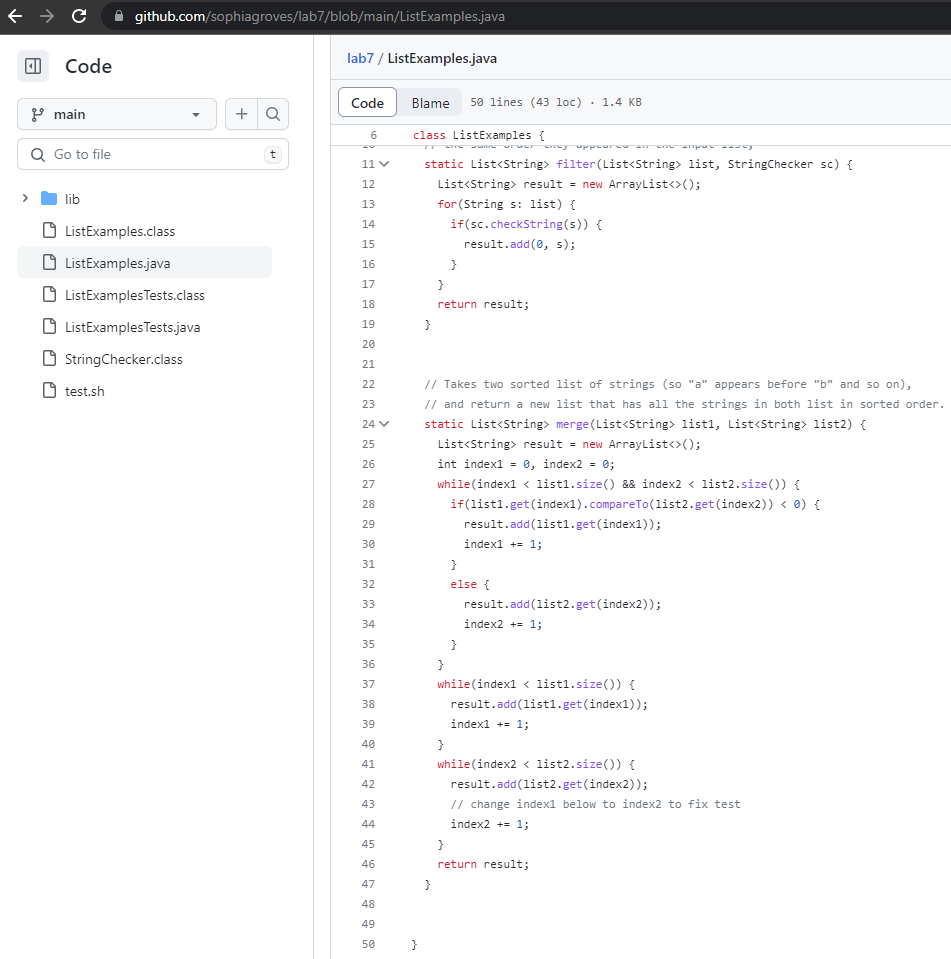

# lab report four

## step 4: Log into ieng6

**keys pressed:**
- `<up> <up> <enter>`
  - The `ssh cs15lsp23nn@ieng6.ucsd.edu` was 2 up in my terminal history, so I accessed it with 2 up arrow. I had set up the SSH key for ieng6 so was not prompted for my password when logging in. 

## step 5: Clone your fork of the repository from your Github account

**keys pressed:** 
- g i t `<space>` c l o n e `<cntrl-v>`
  - I had the repository ssh link ([git@github.com:sophiagroves/lab7.git](git@github.com:sophiagroves/lab7.git)) copied to my clipboard previously, so I pasted it into the terminal. This cloned the lab7 repository into my ieng6 account. 

.png)

## step 6: Run the tests, demonstrating that they fail 

**keys pressed:**
- c d `<space>` l a `<tab> <enter>`
  - I changed my working directory to lab7 to access its files.
- `<up> <up> <up> <up> <enter>`
- `<up> <up> <up> <up> <enter>`
  - The `javac -cp .:lib/hamcrest-core-1.3.jar:lib/junit-4.13.2.jar *.java` and `java -cp .:lib/hamcrest-core-1.3.jar:lib/junit-4.13.2.jar org.junit.runner.JUnitCore ListExamplesTests` commands were in my terminal history, so I accessed them with up arrows. This ran the tests and they failed. 

.png)

## step 7: Edit the code file ListExamples.java to fix the failing test 

**keys pressed:**
- v i m `<space>` `<shift-l>` i `<tab>` . j a v a `<enter>`
  - This command enters vim for the ListExamples.java file. 
- / a n g `<enter>` j r 2 : w q `<enter>`
  - This series of keys searches for "ang" in the file, goes down one line with j, replaces the 1 with 2 using the r key function, then saves and exits vim.

.png)
.png)

## step 8: Run the tests, demonstrating that they now succeed

**keys pressed:**
- `<up> <up> <up> <enter>`
- `<up> <up> <up> <enter>`
  - The testing commands were used previously in step 6, so I accessed them with up arrow. The tests run and pass!

.png)

## step 9: Commit and push the resulting change to your Github account

**keys pressed:**
- g i t a d d . `<enter>`
  - This stages changes for all files in the lab7 repository.
- g i t `<space>` c o m m i t `<space>` - m `<space> <shift-'>` u p d a t e d `<shift-'> <enter>`
  - I commit the staged changes with the message "updated".
- g i t `<space>` p u s h `<enter>`
  - This pushes the changes to GitHub where I can now view the fixed ListExamples file in my Github account online! 

.png)

