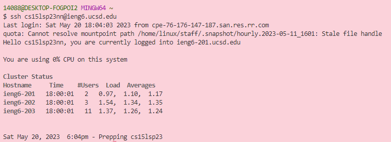

# lab report four

## step 4: Log into ieng6

- `<up> <up> <enter>`

## step 5: Clone your fork of the repository from your Github account
  
- g i t `<space>` c l o n e `<cntrl-v>`
.png)

## step 6: Run the tests, demonstrating that they fail 

- c d `<space>` l a `<tab> <enter>`
- `<up> <up> <up> <up> <enter>`
- `<up> <up> <up> <up> <enter>`

## step 7: Edit the code file ListExamples.java to fix the failing test 

v i m `<space>` `<shift-l>` i `<tab>` . j a v a `<enter>`
/ a n g `<enter>` j r 2 : w q `<enter>`

## step 8: Run the tests, demonstrating that they now succeed
`<up> <up> <up> <enter>`
`<up> <up> <up> <enter>`

## step 9: Commit and push the resulting change to your Github account

g i t a d d . `<enter>`
g i t `<space>` c o m m i t `<space>` - m `<space> <shift-'>` u p d a t e d `<shift-'> <enter>`
g i t `<space>` p u s h `<enter>`
