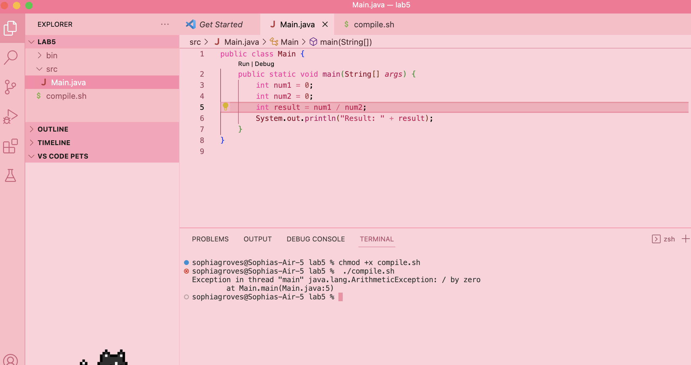
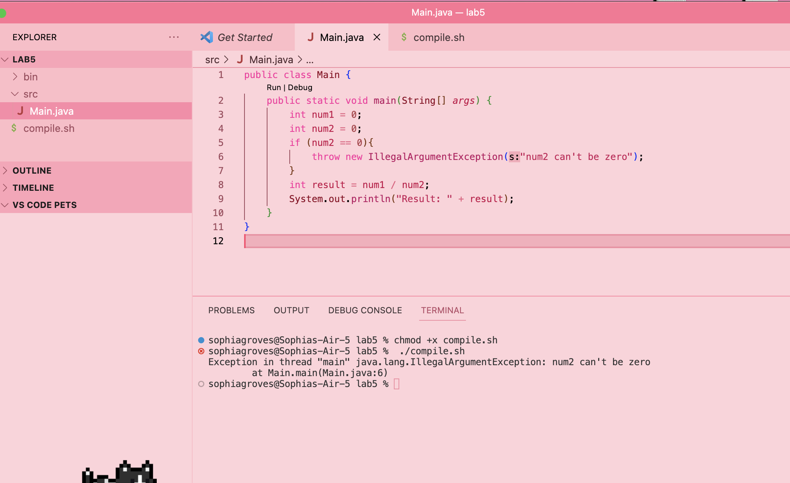

# lab report five


## original post from student: 

Hello TA, 

I am working on a macbook on VScode. 

I am seeing after running my sh file that runs and compiles my code, the error message: 
`Exception in thread "main" java.lang.ArithmeticException: / by zero
        at Main.main(Main.java:5)`
I expected to see `Result: 0`.

My guess is that the bug has something to do with zero in the denominator resulting in an error, although since I'm dividing zero by zero I thought it was fine. 

Here is a screenshot of the symptom:



## response from TA:

Hello student, 

It should seem that dividing by zero in this case is in fact not fine! Is there any way that you could add code that checks for num2 equaling zero and thereafter the lines following don't run if it does?


## edited code by the student and what the bug is:



The bug in the original code was that even if dividing zero by zero, this still results in a division by zero error. There needs to a condition that throws an exception for num2 equaling zero before the method can try to divide with it.   


## all information needed about the setup:

**file and directory structure**
```
project/
├── src/
│   └── Main.java
└── script.sh
```

**The contents of each file before fixing the bug**
in Main.java:
```
public class Main {
    public static void main(String[] args) {
        int num1 = 0;
        int num2 = 0;
        int result = num1 / num2;
        System.out.println("Result: " + result);
    }
}
```

in compile.sh
```
javac -d ./bin ./src/Main.java
java -cp ./bin Main
```

**command lines ran to trigger the bug**
`chmod +x script.sh` `./script.sh`


**what to edit to fix the bug**
add the following lines to the main method before the line `int result = num1 / num2` and after setting the variable values:
```
if (num2 == 0) { 
    throw new IllegalArgumentException("num2 can't be zero);
 }
```

## part two: what I learned 
This quarter I learned that vim exists. I also learned the basic commands of how to move around inside of it, and that it can be useful for very quick editing after becoming profficient on it. 

